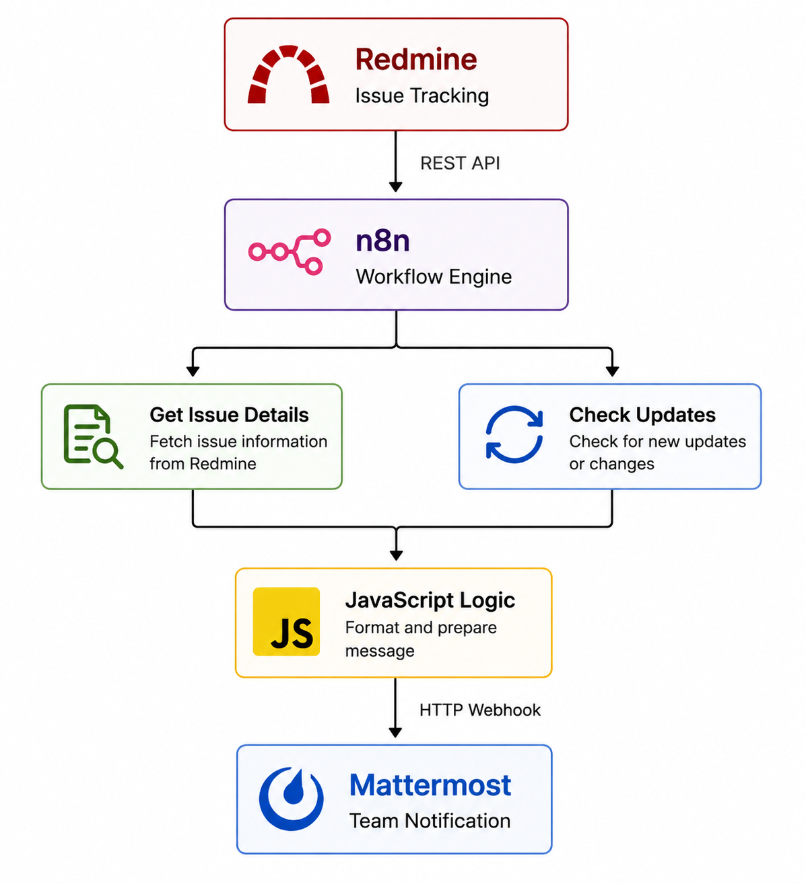

# Redmine Check-in Automation

An automated DevOps workflow that monitors Redmine issues for updates and sends real-time notifications to a Mattermost team channel using n8n.

The project eliminates the need for teams to manually check Redmine for issue changes and provides faster visibility into task updates.

---

## Project Overview

Development teams often manage tasks and incidents in Redmine while communicating through separate team collaboration platforms.

Without automation, team members may need to repeatedly check Redmine to discover:

- Updated issues
- Task changes
- Assignment changes
- Status updates
- New issue activity

This project connects **Redmine, n8n, and Mattermost** to automate this process.

When a Redmine issue is updated, n8n detects the change, processes the issue information, and automatically sends a formatted notification to Mattermost.

---

## Architecture



## How It Works

The workflow follows these steps:

1. n8n starts the workflow on a schedule.
2. n8n retrieves Redmine issues through the REST API.
3. Each issue is processed individually.
4. The workflow retrieves detailed issue information.
5. An IF condition checks whether the issue has update history.
6. JavaScript formats the issue information into a readable message.
7. An HTTP Request sends the message to Mattermost.
8. The development team receives the notification automatically.

---

## Workflow

```text
Schedule Trigger
       │
       ▼
Get Redmine Issues
       │
       ▼
Split Issues
       │
       ▼
Get Issue Details
       │
       ▼
Check Issue Updates
       │
       ▼
      IF
       │
       │ True
       ▼
Code in JavaScript
       │
       ▼
HTTP Request
       │
       ▼
Mattermost
       │
       ▼
Team Notification
```

---

## Update Detection

The workflow checks the Redmine issue journal to determine whether an issue contains update activity.

```javascript
{{$json.issue.journals.length}}
```

The condition is:

```text
journals.length > 0
```

This ensures that only issues containing update activity continue to the notification stage.

---

## Example Notification

When an issue is updated, Mattermost receives a message similar to:

```text
Redmine Issue Updated

Issue: Fix Kubernetes Deployment
Status: New
Priority: Normal
Assigned To: John Doe
Project: DevOps Team
Issue ID: 1
```

This gives the team the important information without requiring them to open Redmine.

---

## Technologies

| Technology | Purpose |
|---|---|
| Redmine | Issue and project management |
| n8n | Workflow automation |
| Mattermost | Team notifications |
| Docker | Containerization |
| Docker Compose | Multi-container environment |
| MySQL | Redmine database |
| JavaScript | Message processing |
| REST API | Redmine integration |
| Webhooks | Mattermost notification delivery |

---

## Docker Environment

The project uses Docker Compose to run the local environment.

### Services

```text
Redmine
n8n
MySQL
```

Check running containers:

```bash
docker compose ps
```

Start the environment:

```bash
docker compose up -d
```

Stop the environment:

```bash
docker compose down
```

View container logs:

```bash
docker compose logs
```

View logs for a specific service:

```bash
docker compose logs redmine
```

```bash
docker compose logs n8n
```

---

## Application Access

### Redmine

```text
http://localhost:3000
```

### n8n

```text
http://localhost:5678
```

---

## Project Structure

```text
redmine-checkin-automation/
│
├── README.md
├── docker-compose.yml
│
├── docs/
│   ├── architecture.md
│   ├── setup.md
│   ├── workflow.md
│   └── testing.md
│
└── screenshots/
    ├── n8n-with-issues-tracking.png
    ├── n8n-docker-installation-success.png
    ├── n8n-redmine-api-configuration.png
    ├── n8n-redmine-api-request.png
    ├── n8n-redmine-mattermost-workflow.png
    ├── n8n-scheduled-workflow-publish.png
    ├── redmine-issue-categories.png
    ├── redmine-project-settings.png
    └── redmine-user-activity.png
```

---

## Configuration

The project requires:

- Docker Desktop
- Redmine
- n8n
- MySQL
- Redmine API access
- Mattermost Incoming Webhook

Credentials and secrets should be configured through environment variables, Docker secrets, or n8n credentials.

---

## Security

Never commit sensitive credentials to GitHub.

Do not expose:

```text
API keys
Passwords
Mattermost webhook URLs
Database passwords
Access tokens
.env files
Private credentials
```

Use `.gitignore` to prevent accidental commits of sensitive files.

Example:

```gitignore
.env
*.env
.env.*
credentials.json
secrets/
*.key
*.pem
```

---

## Testing

To test the automation:

### Step 1 — Open Redmine

```text
http://localhost:3000
```

### Step 2 — Open an existing issue

For example:

```text
Fix Kubernetes Deployment
```

### Step 3 — Add an update

Example:

```text
Monitoring progress updated.
```

Save the issue.

### Step 4 — Run the n8n workflow

Execute the workflow manually during testing.

### Step 5 — Verify Mattermost

The updated issue should appear automatically in the configured Mattermost channel.

---

## Production Automation

After successful testing, the n8n Schedule Trigger can be configured to run every 5 minutes.

The production flow becomes:

```text
Redmine
   │
   ▼
Scheduled n8n Workflow
   │
   ▼
Detect Issue Updates
   │
   ▼
Process Issue
   │
   ▼
Send Mattermost Notification
   │
   ▼
Development Team
```

This allows the team to receive important Redmine updates without manually checking the project.

---

## Screenshots

The `screenshots/` directory contains visual documentation of the implementation, including:

- Redmine issue management
- Redmine project configuration
- Redmine user activity
- n8n Docker deployment
- Redmine API configuration
- Redmine API requests
- n8n workflow automation
- Scheduled workflow publishing
- Issue tracking automation

---

## Key DevOps Concepts Demonstrated

This project demonstrates practical experience with:

- Workflow automation
- REST API integration
- Docker containerization
- Docker Compose
- Scheduled automation
- Conditional workflow logic
- JavaScript automation
- HTTP APIs
- Webhooks
- Issue tracking
- Team notifications
- Infrastructure automation
- Secure credential management

---

## Business Value

The automation reduces repetitive manual work by automatically communicating Redmine changes to the development team.

Instead of:

```text
Engineer
   ↓
Open Redmine
   ↓
Check Issues
   ↓
Find Changes
   ↓
Notify Team
```

The automated process is:

```text
Redmine
   ↓
n8n detects update
   ↓
Issue processed
   ↓
Mattermost notification
   ↓
Team informed
```

This improves visibility, reduces manual checking, and helps teams respond to changes faster.

---

## Future Improvements

Potential improvements include:

- Automatic error notifications
- Status-change detection
- Priority-change detection
- New issue notifications
- Assignment-change notifications
- Rich Mattermost messages
- User-specific notifications
- Redmine webhook triggers
- Automated daily reports
- Workflow monitoring
- Error recovery
- CI/CD integration
- Automated testing

---

## Skills Demonstrated

```text
Docker
Docker Compose
n8n
Redmine
Mattermost
REST APIs
JavaScript
Webhooks
Workflow Automation
DevOps
Infrastructure Automation
```

---

## Author

**Oluwaferanmi Dada**

DevOps / Cloud Engineer

GitHub: **feranzeey**

---

## Project Goal

The goal of this project is simple:

> Automatically detect Redmine issue updates and make sure the right team members know about them without manually checking Redmine.

This project demonstrates how DevOps automation can connect development tools together to create a faster and more reliable engineering workflow.